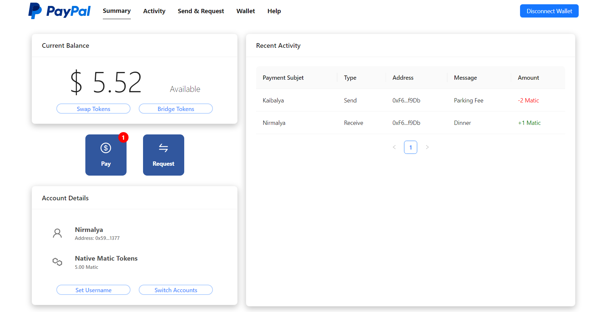
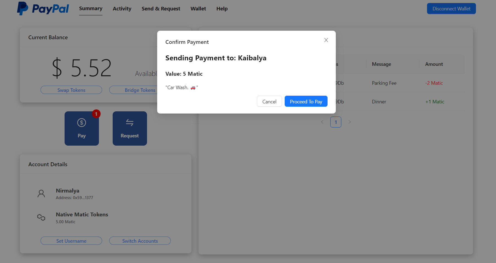
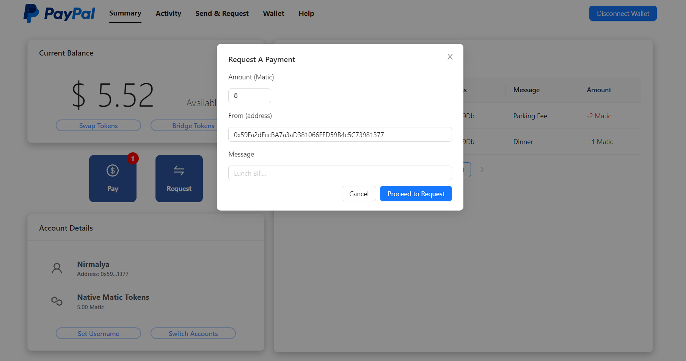

# Web 3.0 PayPal

This is a repository for PayPal Clone with Solidty, TypeScript, React, HardHat, Vite, Moralis, ethers & wagmi.

### Prerequisites

**Node ^= v16.14.2**

**VS Code (IDE)**

### Cloning the repository

```shell
git clone https://github.com/nayak-nirmalya/web3_paypal.git
```

## Running Project

Compile & Deploy Smartcontract.

```shell
cd smartcontract
pnpm install
pnpm hardhat compile
pnpm hardhat run scripts/deploy.ts --network polygon_mumbai
```

Start Back-End Express Server with Moralis API.

```shell
cd backend
pnpm install
pnpm dev
```

Start Front-End React Server with Vite.

```shell
cd frontend
pnpm install
pnpm dev
```

## Screenshots

<div align='center'>

### HomePage



### Send Payment



### Send Request



</div>
